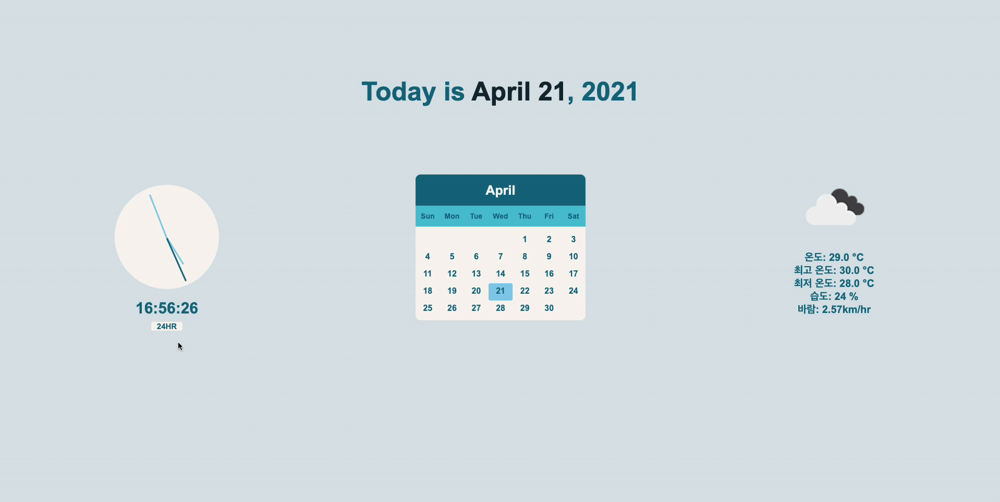
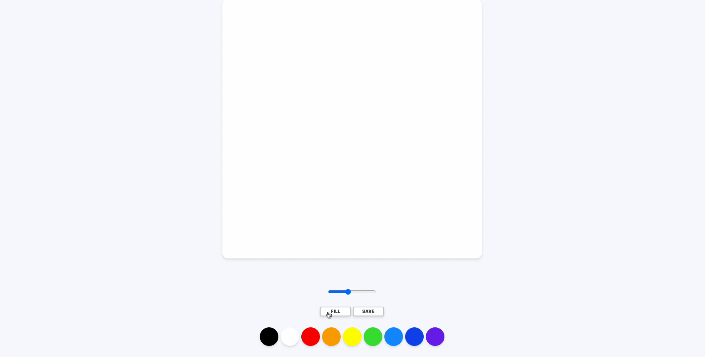

# ✨ SOPT 28th Web

# 2nd Seminar Assignments
- Practicing CSS3, HTML5, and Vanilla JS

### 1. [Clock, Calendar, and Weather Webpage](https://github.com/jenehojinchoi/SOPT_28th_Web/tree/feature/initial/2nd_seminar_1)
- gets live location and retrieves weather data from [OpenWeather API](https://openweathermap.org/api)
- added function to button for user to convert between AM/PM and 24-hour clock

### 2. [Painting Webpage](https://github.com/jenehojinchoi/SOPT_28th_Web/tree/feature/initial/2nd_seminar_2)
- learned from a free course, [Build a Painting App](https://nomadcoders.co/javascript-for-beginners-2)
- added modal window to ask if user wants to save image

